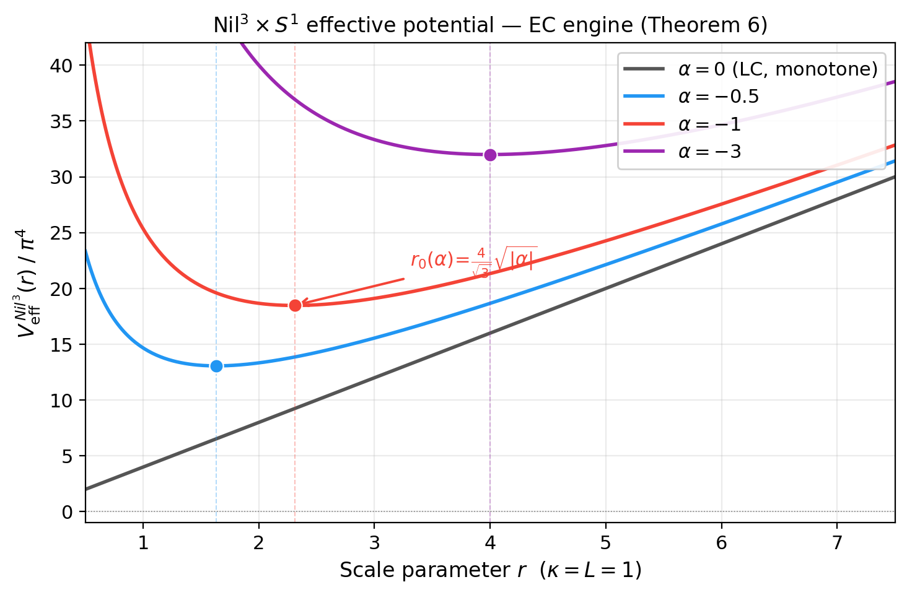
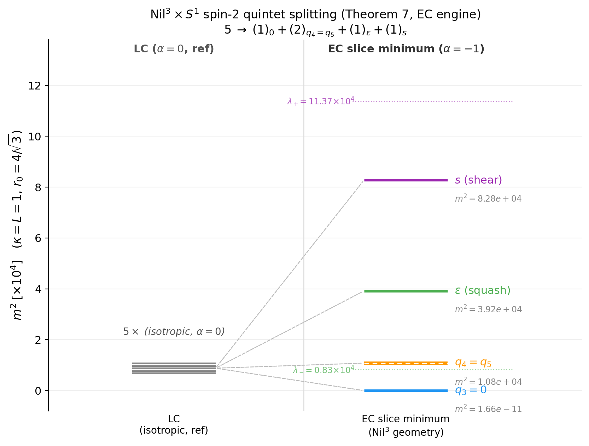

## 5. Mode dictionary: $Nil^3\times S^1$ under EC-Weyl

本節では $Nil^3\times S^1$ の均質幾何自由度に対する EC-Weyl 結合の効果を詳細に解析する。 $Nil^3$ は 3 トポロジーの中で唯一の非共形平坦多様体であり、これが EC-Weyl 結合を通じて $\eta=V=0$ 断面の EC slice minimum（定理 6）、spin-2 quintet 分裂（定理 7）、1 軸質量分裂（定理 8）を生成する。

### 5.1 Nil³ の幾何的特徴

$Nil^3$（3 次元 Heisenberg 多様体）の幾何は 1 つの非零構造定数

$$
C^2_{01}(Nil^3) = \frac{1}{R}
$$

によって特徴付けられる（ $R$ : Nil³ のスケールパラメータ）。本文では Lie 括弧 $[E_0,E_1]=(1/R)E_2$ 規約でこの符号を用いる。一方、実装では Maurer-Cartan 形 $d\sigma^2=-\sigma^0\wedge\sigma^1$ を直接使うため、frame 係数は $C[2,0,1]=-(1+\varepsilon)^{-4/3}(1+s)^{-2}/R$ と書かれる。両者は同じ Heisenberg 構造を表す規約差である。この 1 成分の Lie 構造が、後の spin-2 quintet 分裂と 1 軸質量分裂の起源になる。

**非共形平坦性**: $Nil^3$ の背景（ $\eta = V = 0$ ）における Weyl scalar は

$$
C^2_{\rm LC}(Nil^3,\, \eta=V=0) = \frac{4}{3R^4} \neq 0
$$

である。この非共形平坦性が EC-Weyl 結合 $\alpha \cdot C^2_{\rm EC}$ を $\eta=V=0$ 断面でも活性化し、EC slice minimum を生む（§5.2 参照）。

一方、formal MIXING sector に対する auxiliary cubic coefficient は

$$
C_\delta(Nil^3)=0,
\qquad
\frac{\partial C_\delta(Nil^3)}{\partial\alpha}=0
$$

である（定理 3, App. D）。したがって $Nil^3$ の EC 固有物理は background Weyl と $(r,\eta,V)$ sector に現れるのであって、新しい $\delta$-sector cubic channel として現れるのではない。

### 5.2 定理 6 (Nil³ EC slice minimum)

**定理 6 (Nil³ EC slice minimum)**: $\alpha < 0$ において、 $Nil^3\times S^1$ の均質有効ポテンシャルを $\eta = V = 0$ 断面へ制限すると、正の EC-induced slice minimum

$$
r_0 = \frac{4\kappa}{\sqrt{3}}\sqrt{|\alpha|}, \qquad V_0 = \frac{32\sqrt{3}\,\pi^4 La}{3\kappa} > 0, \quad (\alpha = -a^2,\; a > 0)
$$

を持つ。さらに、この点 $(r,\eta,V)=(r_0,0,0)$ は full homogeneous potential に対して

$$
|\kappa^2\theta_{\rm NY}|<1 \;\Rightarrow\; \text{local minimum}, \qquad
|\kappa^2\theta_{\rm NY}|=1 \;\Rightarrow\; \text{marginal}, \qquad
|\kappa^2\theta_{\rm NY}|>1 \;\Rightarrow\; \text{saddle}
$$

となる。旧稿ではこれを `false vacuum` と呼んでいたが、本稿では $\eta=V=0$ 断面で最初に同定されることと full homogeneous stability の条件を明示するため、`EC slice minimum` と呼ぶ。

**証明**: AX/VT dropout（定理 1）により、AX 背景（ $V=0$ ）および VT 背景（ $\eta=0$ ）では $C^2_{\rm EC} = C^2_{\rm LC}$ が保たれ、EC-LC 差分はゼロである。したがって EC 拡張は AX/VT における LC 側の停留条件をずらさない。なお $Nil^3$ では $C^2_{\rm LC}\neq 0$ なので、 $\alpha$ 依存そのものは LC-Weyl 項を通じて残る。

$\eta = V = 0$ の等方断面での有効ポテンシャルは、SymPy 計算により $\,\theta_{\rm NY}\,$ に依存しない 2 項構造

$$
V_{\rm eff}^{Nil^3}(r,\, \eta=0,\, V=0;\, \alpha) = \frac{4\pi^4 Lr}{\kappa^2} - \frac{64\pi^4 L\alpha}{3r}
$$

を持つことが確認される。ここで第 1 項は LC 寄与（ $n=1$ の幂乗）、第 2 項は EC-Weyl 寄与（ $m=-1$ の幂乗）である。

極小条件 $\partial V_{\rm eff}/\partial r = 0$ から

$$
\frac{4\pi^4 L}{\kappa^2} + \frac{64\pi^4 L\alpha}{3r^2} = 0 \quad \Rightarrow \quad r_0^2 = -\frac{16\alpha\kappa^2}{3} = \frac{16|\alpha|\kappa^2}{3}, \quad r_0 = \frac{4\kappa}{\sqrt{3}}\sqrt{|\alpha|}
$$

が解析的に確定される。真空エネルギーは

$$
V_0 = V_{\rm eff}(r_0) = \frac{32\sqrt{3}\,\pi^4 L a}{3\kappa} > 0 \quad (\alpha = -a^2 < 0)
$$

であり、 $V_0 > 0$ は正のエネルギーを持つ slice minimum であることを示す。

full homogeneous stability は Hessian

$$
H = \left.\frac{\partial^2 V_{\rm eff}}{\partial(r,\eta,V)^2}\right|_{(r_0,0,0)}=
\begin{pmatrix}
\dfrac{2\sqrt{3}\pi^4 L}{\kappa^3\sqrt{-\alpha}} & 0 & 0 \\
0 & \dfrac{128\sqrt{3}\pi^4 L\sqrt{-\alpha}}{\kappa} & -\dfrac{512\pi^4 L\alpha\kappa^2\theta_{\rm NY}}{3} \\
0 & -\dfrac{512\pi^4 L\alpha\kappa^2\theta_{\rm NY}}{3} & \dfrac{2048\sqrt{3}\pi^4 L\kappa(-\alpha)^{3/2}}{27}
\end{pmatrix}
$$

で判定できる。 $r$ 方向の主小行列は常に正であり、残る $(\eta,V)$ block の判定式は

$$
\det H_{(\eta,V)} = \frac{262144\pi^8L^2\alpha^2}{9}\left(1-\kappa^4\theta_{\rm NY}^2\right)
$$

である。したがって Sylvester 判定法により、上の $|\kappa^2\theta_{\rm NY}|<1$ 条件が従う。詳細は [`script/scripts/proofs/nil3_slice_minimum_stability.py`](script/scripts/proofs/nil3_slice_minimum_stability.py) を参照。

**全点との照合**（SymPy 解析解 vs 数値）:

| $\alpha$ | $r_0$ 解析 | $r_0$ 数値 | 誤差 | $V^c$ 解析 | $V^c$ 数値 | 誤差 |
|---|---|---|---|---|---|---|
| $-0.05$ | 0.516398 | 0.516400 | 0.0004% | 402.415 | 402.415 | $< 10^{-6}$% |
| $-0.50$ | 1.632993 | 1.633000 | 0.0004% | 1272.547 | 1272.547 | $< 10^{-6}$% |
| $-1.00$ | 2.309401 | 2.309400 | 0.0000% | 1799.653 | 1799.653 | $< 10^{-6}$% |
| $-3.00$ | 4.000000 | 4.000000 | 0.0000% | 3117.091 | 3117.091 | 0% |

**Fig. 1** $Nil^3$ effective potential and EC slice minimum.

### 5.3 定理 7 (Nil³ spin-2 quintet 分裂)

**定理 7 (Nil³ quintet 分裂)**: $Nil^3\times S^1$ の EC slice-minimum branch 周りの spin-2 quintet（5 成分）は

$$
5 \;\to\; (1)_0 + (2)_{q_4=q_5} + (1)_\varepsilon + (1)_s
$$

の形で分裂する。ここで括弧内は縮退度を表す。

**完全 spin-2 quintet 分裂パターン**（ $a = \kappa = L = 1$, $r_0 = 4/\sqrt{3}$, $\alpha = -1$ ）:

| 成分 | 自由度 | 質量 $m^2$ | 物理的解釈 |
|---|---|---|---|
| $q_3$ | off-diagonal $(0–1)$ | **0**（zero mode） | Nil³ 対称性による幾何的保護 |
| $q_4$ | off-diagonal $(0–2)$ | $1.080\times 10^4$ | 縮退質量 |
| $q_5$ | off-diagonal $(1–2)$ | $1.080\times 10^4$ | $q_4$ と縮退（Nil³ 対称性） |
| $\varepsilon$ | squash | $3.919\times 10^4$ | 軸変形（ $U(1)$ 破れ） |
| $s$ | shear | $8.278\times 10^4$ | 剪断変形 |

**Fig. 2** $Nil^3$ spin-2 quintet splitting $5\to 0+2+1+1$ .

squash-shear block の固有値は $\lambda_+ = 1.137\times 10^5$, $\lambda_- = 8.280\times 10^3$（SymPy 確認）。

**$q_3 = 0$ の幾何的解釈**: $G_3$ 変換は $(e^0, e^1)$ 平面の双曲回転

$$
e^0 \to c_3 e^0 + s_3 e^1, \quad e^1 \to s_3 e^0 + c_3 e^1 \quad (c_3^2 - s_3^2 = 1)
$$

である。Nil³ の唯一の構造定数 $C^2_{01}$ はこの変換のもとで

$$
C^2_{01} \to \frac{c_3^2 - s_3^2}{R} = \frac{1}{R}
$$

と不変に保たれる（双曲恒等式）。したがって $V_{\rm eff}$ が $q_3$ に依存しないため $m^2(q_3) = 0$ となる。これは tachyon ではなく、Nil³ の 1 次元 Lie 構造（ $C^2_{01}$ のみ）による幾何的対称性保護である。

**$q_4 = q_5$ 縮退の解釈**: $G_4$, $G_5$ はそれぞれ $(0–2)$, $(1–2)$ 平面の双曲回転である。Nil³ では $e^2$ が $C^2_{01}$ の「結果軸」であり、 $e^0$ と $e^1$ が $C^2_{01}$ に対して対等な役割を果たす。この対称性から $m^2(q_4) = m^2(q_5)$ となる。

[スクリプト: `paper03ec/nil3_spin2_quintet_splitting.py`]

### 5.4 定理 8 (1 軸質量分裂)

**定理 8 (1 軸質量分裂)**: $Nil^3\times S^1$ の spin-1 セクターでは、 $C^2_{01}$ の方向選択性により 1 軸のみが質量を持つ：

$$
m^2(\omega_2) = \frac{24\pi^4 L^3 R^2 - 256\pi^4 L^3\alpha\kappa^2}{3R^3\kappa^2} \neq 0, \qquad m^2(\omega_0) = m^2(\omega_1) = 0.
$$

EC slice minimum $r_0 = 4\kappa a/\sqrt{3}$（ $\alpha = -a^2$ ）での値は

$$
m^2(\omega_2)\big|_{r_0} = \frac{6\sqrt{3}\,\pi^4 L^3}{a\kappa^3}.
$$

**物理的解釈**: $C^2_{01}$ は $(0–1)$ 平面方向の非可換性に対応する。 $\omega_2$ は $(0–1)$ 方向の twist であり、 $C^2_{01} \neq 0$ によりこの成分のみが有効ポテンシャルに質量を受け取る。 $\omega_0, \omega_1$ は ( $C^2_{01}$ に関して）可換方向であり、質量ゼロのままである。

以後この構造を 1 軸質量分裂と呼ぶ。 $Nil^3$ の 1 次元 Lie 代数構造 ( $C^2_{01}$ のみ非零) が、spin-1 triplet の中で唯一の $\omega_2$ に質量を与え、残りの 2 成分を質量ゼロに保つ。

### 5.5 Nil³ EC slice minimum の EFT

EC slice minimum $r_0 = 4\kappa a/\sqrt{3}$ 周りの二次有効作用を確定する。以下では、spin-0 Hessian が diagonal block に戻る標準ベンチマーク $\theta_{\rm NY}=0$ を用いて quoted EFT を与える。

**全二次係数スペクトル（ $a = \kappa = L = 1$ での数値）**:

| 自由度 | 二次係数（解析式） | 数値 ($a=\kappa=L=1$) | $\alpha$ 依存性 |
|---|---|---|---|
| $r$（径方向） | $2\sqrt{3}\pi^4 L/(a\kappa^3)$ | 337.4 | $\propto 1/a$（軽） |
| $\omega_2$（非可換 spin-1） | $6\sqrt{3}\pi^4 L^3/(a\kappa^3)$ | 1012 | $\propto 1/a$（軽） |
| $\eta$（軸性捩れ; 非伝播） | $128\sqrt{3}\pi^4 La/\kappa$ | 21,596 | $\propto a$（ $\eta$ 方向曲率） |
| spin-2 squash | $6272\sqrt{3}\pi^4 La/(27\kappa)$ | 39,192 | $\propto a$（重） |
| $\omega_0, \omega_1$ | $0$ | 0 | 質量ゼロ |
| $q_3$ | $0$ | 0 | zero mode |

**2 群階層構造**: "幾何モード"（ $r$, $\omega_2$ ）は $\propto 1/a$（ $|\alpha|$ 大で軽量化）、"捩れ/曲率モード"（ $\eta$ 方向曲率, spin-2）は $\propto a$（ $|\alpha|$ 大で重量化）という対照的な $\alpha$ 依存性を持つ。

二次有効作用は

$$
{V_{\rm eff}}^{Nil^3}_{\rm EFT}
\approx V_0+
\frac{1}{2}\frac{2\sqrt{3}\pi^4 L}{a\kappa^3}(\delta r)^2+
\frac{1}{2}\frac{128\sqrt{3}\pi^4 La}{\kappa}(\delta\eta)^2+
\frac{1}{2}\frac{6272\sqrt{3}\pi^4 La}{27\kappa}(\delta\varepsilon)^2+
\frac{1}{2}\frac{6\sqrt{3}\pi^4 L^3}{a\kappa^3}(\delta\omega_2)^2+
O(\delta^3)
$$

として与えられる（ $\delta r$ と $\delta\eta$ の交差項はゼロ）。ここで $\delta\eta$ の係数は propagating mass ではなく、Palatini 保護（ $G_{\eta\eta}=0$ ）のもとでの $\eta$ 方向ポテンシャル曲率を表す。[スクリプト: `paper03ec/nil3_ec_slice_minimum_eft.py`]

### 5.6 Mode dictionary table (Table 3: Nil³×S¹)

**Table 3: $Nil^3\times S^1$ mode dictionary under EC-Weyl**

| 物理量 | AX ($V=0, \eta\neq 0$) | VT ($\eta=0, V\neq 0$) | EC slice minimum ($\eta=V=0, \alpha<0$) |
|---|---|---|---|
| $C^2_{\rm EC}$ | $= C^2_{\rm LC} = 4/(3R^4)$ | $= C^2_{\rm LC} = 4/(3R^4)$ | $= C^2_{\rm LC} = 4/(3R^4)$ |
| AX/VT dropout | ✓ | ✓ | ✗（ $C^2_{\rm LC}\neq 0$ ） |
| spin-0: $r$ | 力学的 | 力学的 | 力学的（ $m^2_r = 2\sqrt{3}\pi^4 L/(a\kappa^3)$ ） |
| spin-0: $\eta, V$ | $\eta$ 非力学的 | $V$ 非力学的 | $\eta$ 非伝播, $V=0$（ $\eta$ 方向曲率係数 $= 128\sqrt{3}\pi^4 La/\kappa$ ） |
| spin-2 質量 $\mu^2$ | $(1056\pi^4 LR^2 - 19456\pi^4 L\alpha\kappa^2)/(27R\kappa^2)$ | 同左 | at $r_0$: $6272\sqrt{3}\pi^4 La/(27\kappa)$ |
| spin-2 分裂 | （等方点） | — | $5\to 0+2+1+1$（定理 7） |
| spin-1 質量分裂 | 1 軸質量分裂: $m^2(\omega_2)\neq 0$, $m^2(\omega_{0,1})=0$ | — | at $r_0$: $m^2(\omega_2) = 6\sqrt{3}\pi^4 L^3/(a\kappa^3)$（定理 8） |

**補足 - $Nil^3$ MX 背景の EC 補正**:  
MX 背景（ $V\neq 0, \eta\neq 0$ ）では §2.3 の一般式より  

$$
\Delta V_{\rm eff}^{\rm EC}(Nil^3, {\rm MX}) = -\frac{256\pi^4 L R V^2 \alpha \eta^2}{3}\neq 0
$$

が EC-LC 差分として生じる（SymPy 確認: `nil3_mode_dictionary.py`）。  
ただし MX 条件 $V\eta\neq 0$ を課した停留点は、T³ と同様に **$\alpha<0$ 分枝で実数解を持たない**。 $\theta_{\rm NY}=0$ では

$$
V_{\ast}=\pm\frac{3}{4}\sqrt{\frac{1}{\alpha}}, \qquad \eta_{\ast}=\pm\frac{R}{4}\sqrt{\frac{1}{\alpha}}
$$

となるため、 $\alpha<0$ では純虚解である。一般の $\theta_{\rm NY}$ についても補助スクリプト `paper03ec/nil3_mx_vacuum_search.py` の有限サンプル root search では辞書範囲内に安定な MX 点は見つからない。ただし本稿で厳密に用いるのは、$\eta=V=0$ stationary point の解析式と full-Hessian criterion $|\kappa^2\theta_{\rm NY}|<1$ である。Nil³ の EC 固有物理（EC slice minimum, quintet 分裂）は $\eta=V=0$ 断面の $C^2_{\rm LC} \neq 0$ に由来し、MX 補正とは独立である。
