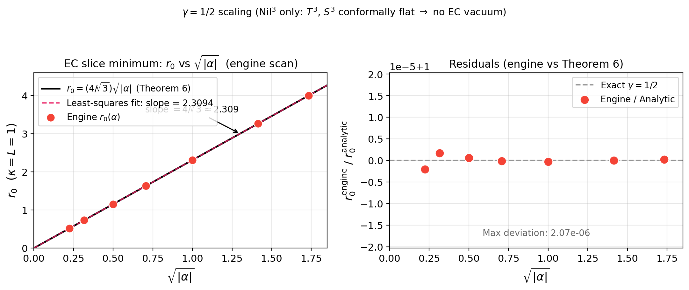

## 6. Three-topology comparison

本節では §3–5 の成果を統合し、 $S^3\times S^1$、 $T^3\times S^1$、 $Nil^3\times S^1$ の 3 トポロジーにわたる系統的比較を行う。主結果は **定理 9（ε-s cross-term 分類）** であり、 $\gamma = 1/2$ スケーリング定理と共形平坦性定理がこれを補完する。

### 6.1 Table 4: 3 トポロジー比較サマリー

**Table 4: $S^3$, $T^3$, $Nil^3$ の EC-Weyl 下での比較**

| 物理量 | $T^3\times S^1$ | $Nil^3\times S^1$ | $S^3\times S^1$ |
|---|---|---|---|
| **$\eta=V=0$ 断面での EC slice minimum（ $\alpha<0$ ）** | なし | **あり（新出現）** | なし |
| **$C^2_{\rm LC}$（ $\eta=V=0$ ）** | $0$（平坦） | **$4/(3R^4) \neq 0$** | $0$（共形平坦） |
| **共形平坦性** | ✓（平坦） | ✗（**非共形平坦**） | ✓（共形平坦） |
| **Palatini 保護** | ✓ | ✓ | ✓ |
| **spin-2 構造（AX 背景）** | $0$（平坦性） | 非零質量 | $128\pi^2 Lr/(3\kappa^2) - 16384\pi^2 L\alpha/(3r)$（5 重縮退） |
| **spin-1 構造** | 全成分 質量ゼロ | **1 軸質量分裂**（ $\omega_2$ のみ） | 3 重縮退 |
| **$\gamma_{\rm EC}$** | — | **$1/2$（厳密）** | — |
| **ε-s cross-term** | kinematic | curvature/Weyl | $0$（消滅） |

### 6.2 定理 9 (ε-s cross-term 分類)

**定理 9 (ε-s cross-term 分類)**: squash パラメータ $\varepsilon$ と shear パラメータ $s$ の混合 2 次微分 $\partial^2 V/\partial\varepsilon\partial s\big|_{\varepsilon=s=0}$ は、3 トポロジーで本質的に異なる起源を持つ：

| トポロジー | $\partial^2 V/\partial\varepsilon\partial s$ | 起源 | 体積保存 |
|---|---|---|---|
| $T^3$ | $48\pi^4 L\eta^2 r/\kappa^2 \neq 0$ | **純 kinematic**（体積非保存） | ✗ |
| $Nil^3$ | $(384\pi^4 LR^2 - 8192\pi^4 L\alpha\kappa^2)/(9R\kappa^2) \neq 0$ | **純 curvature/Weyl** | ✓ |
| $S^3$ | $0$（SymPy exact） | 消滅（体積保存 $+$ $s\to -s$ 対称性） | ✓ |

**証明の概略**: 詳細な式展開は [Appendix C](paper03ec_appC.md) に譲る。本文で必要な論点は次の 3 点である。

- $T^3$ では体積因子 $(1+\varepsilon)(1+s)$ が非自明であり、 $C^a_{bc}=0$ にもかかわらず純粋に kinematic な cross-term が生じる（定理 5, App. C.2）。
- $Nil^3$ では体積保存は成り立つが、 $C^2_{01}$ の方向非対称性により $\alpha$ 依存の curvature/Weyl 起源 cross-term が残る（App. C.1.2, C.4）。
- $S^3$ では体積保存に加えて $s\to -s$ 対称性があるため、cross-term は消滅する（App. C.1.1, C.3）。

**物理的意味**: この分類は各トポロジーの幾何的性質（平坦性, 共形平坦性, 体積保存, 非可換構造）を squash-shear cross-term という観測量に直接写し込む。[スクリプト: `paper03ec/squash_shear_cross_term.py`]

### 6.3 γ = 1/2 スケーリング定理

**Fig. 3** $\gamma=1/2$ scaling $r_0 \propto \sqrt{|\alpha|}$

$Nil^3\times S^1$ の EC slice minimum のスケーリング指数を解析的に確定する。

有効ポテンシャルが 2 項構造

$$
V_{\rm eff} = A\cdot r^n + \alpha\cdot B\cdot r^m
$$

を持つ場合、一般的なスケーリング則は

$$
r_0 \propto |\alpha|^{1/(n-m)}, \quad V^c \propto |\alpha|^{n/(n-m)}, \quad \gamma = \frac{n}{n-m}.
$$

$Nil^3$ では $n = 1$（LC 項の幂乗）, $m = -1$（EC 項の幂乗）であるから

$$
n - m = 2, \quad \gamma = \delta = \frac{1}{2} \quad (\text{代数的必然}).
$$

**$T^3$, $S^3$ への非適用性**: $T^3$ は平坦（ $C^2_{\rm LC} = 0$ ）、 $S^3$ は共形平坦（ $C^2_{\rm LC}({\eta=V=0}) = 0$ ）であるため、EC-Weyl 項 $\alpha \cdot C^2_{\rm EC}$ が $\eta=V=0$ 断面に寄与しない（§6.4 参照）。したがってこのスケーリング則は $Nil^3$ にのみ適用される。

[スクリプト: `proofs/gamma_scaling_proof.py`]

### 6.4 共形平坦性と $\eta=V=0$ 断面の EC slice minimum

3 トポロジーの EC 真空出現を統一的に説明する定理を述べる。

**定理（3 トポロジーにおける共形平坦性と EC slice minimum）**:

$$
C^2_{\rm LC}(\eta=V=0) = 0 \;\Longrightarrow\; \eta=V=0 \text{ 断面に EC slice minimum は現れない.}
$$

各トポロジーへの適用：

- **$T^3$（平坦）**: $C^2_{\rm LC} = 0$ により $\alpha$ は $V_{\rm eff}(\eta=V=0)$ を変えない。したがってこの断面上に EC slice minimum は現れない。
- **$S^3$（共形平坦）**: $C^2_{\rm LC}(S^3, \eta=V=0) = 0$ であるため同様に EC slice minimum は現れない。
- **$Nil^3$（非共形平坦）**: $C^2_{\rm LC}(Nil^3) = 4/(3R^4) \neq 0$ により $\alpha \cdot C^2_{\rm LC} \cdot \text{Vol} = -64\pi^4 L\alpha/(3r)$ が有効ポテンシャルに加わり、 $\alpha < 0$ で $\eta=V=0$ 断面の EC slice minimum が出現する（定理 6）。この点はさらに $|\kappa^2\theta_{\rm NY}|<1$ で full homogeneous local minimum になる。

**まとめ**: 本論文で扱った 3 トポロジーの中では、共形平坦な背景では $\eta=V=0$ 断面の EC-Weyl 補正が消え、非共形平坦な $Nil^3$ でのみ EC slice minimum が現れる。

### 6.5 AX/VT dropout の普遍性

定理 1 の AX/VT dropout は全 3 トポロジーで成立し、EC-Weyl 結合の幾何的影響を精密に局所化する。

**普遍的帰結**: EC-Weyl 相互作用 $\alpha \cdot C^2_{\rm EC}$ の LC からの差異（新寄与）は、torsion の「混合積」 $V\times\eta \neq 0$ の MX 背景においてのみ顕在化する。AX 単独あるいは VT 単独の torsion では、いかなるトポロジーにおいても EC-Weyl 補正はゼロとなる。

**物理的含意**: この選択則は EC 接続の代数的構造から来る普遍的な性質であり、特定のトポロジーに依存しない。torsion が単純（1 成分）な背景では、contortion の asymmetric な積み合わせが必要な Weyl 成分を活性化できないことを意味する。

3 トポロジー比較における EC-Weyl 結合の効果は以下に集約される：

| 状況 | EC の効果 | 3 トポロジー共通 |
|---|---|---|
| AX 背景 | $C^2_{\rm EC} = C^2_{\rm LC}$, EC-LC 差分ゼロ | ✓ |
| VT 背景 | $C^2_{\rm EC} = C^2_{\rm LC}$, EC-LC 差分ゼロ | ✓ |
| MX 背景（ $T^3, S^3$ ） | EC 補正あり（ $16V^2\eta^2/3r^2$ ）、しかし安定化なし | — |
| $\eta=V=0$ 断面（ $Nil^3$, $\alpha<0$ ） | 非共形平坦な LC 背景により **EC slice minimum 出現** | — |

この 4 分類が本論文の EC-Weyl 結合の物理的全体像を与える。
